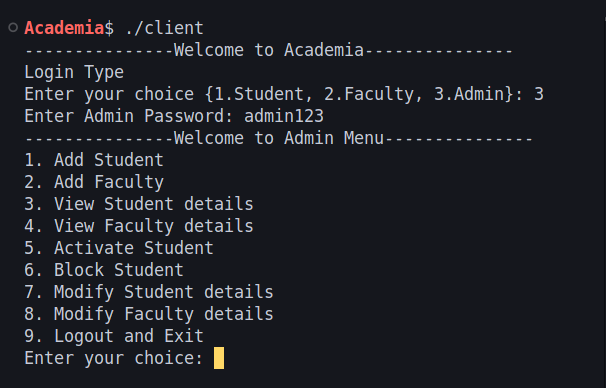
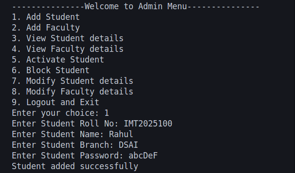
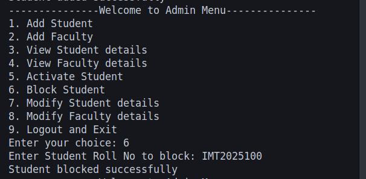
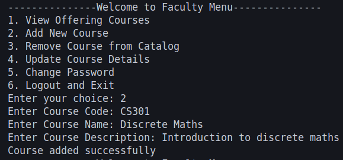
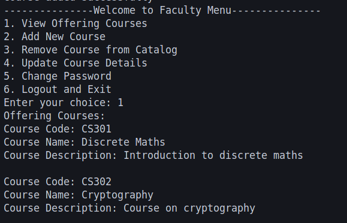
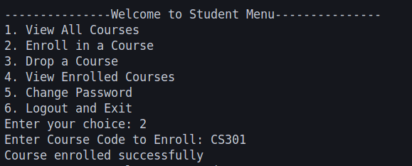
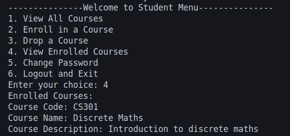
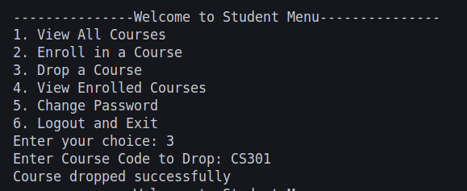

# Academia: Course Registration Portal

## Problem Statement

The Academia project aims to design and develop a course registration portal for an academic institution. The portal provides functionalities for three types of users: students, faculty, and administrators. Each user type has specific roles and permissions, such as enrolling in courses, managing course offerings, and modifying user details. The system ensures secure communication between the client and server and maintains data integrity through file-based storage with locking mechanisms.

## Implementation Details

The Academia project is implemented in C and follows a client-server architecture. The key components of the system are:

1. **Client Application**: Handles user interactions and sends requests to the server.
2. **Server Application**: Processes client requests and performs operations on the data.
3. **File-Based Storage**: Stores data for students, faculty, courses, and enrollments in binary files.
4. **Message-Based Communication**: Uses structured messages to exchange data between the client and server.

### Key Features

- **Student Functionalities**:
  - View all available courses.
  - Enroll in or drop courses.
  - View enrolled courses.
  - Change password.
- **Faculty Functionalities**:
  - View courses they are offering.
  - Add, remove, or update course details.
  - Change password.
- **Admin Functionalities**:
  - Add students and faculty.
  - View and modify student and faculty details.
  - Activate or block students.

### File Locking

To ensure data integrity, file locking is implemented using `flock`. This prevents concurrent access issues when multiple users perform operations simultaneously.

### Communication Protocol

The client and server communicate using a predefined message structure (`struct message`) that encapsulates the type of operation and associated data.

## Code Snippets and Explanation

### 1. Client-Server Connection

The `connect_to_server` function in `client.c` establishes a connection to the server:

```c
int connect_to_server() {
    int sock;
    struct sockaddr_in server_addr;

    fillzero(server_addr);
    sock = socket(AF_INET, SOCK_STREAM, 0);
    if (sock < 0) {
        perror("socket():");
        exit(1);
    }

    server_addr.sin_family = AF_INET;
    server_addr.sin_addr.s_addr = inet_addr("127.0.0.1");
    server_addr.sin_port = htons(SRV_PORT);

    if (connect(sock, (struct sockaddr *)&server_addr, sizeof(server_addr)) < 0) {
        perror("connect():");
        exit(1);
    }

    return sock;
}
```

This function creates a socket, defines the server's address and port, and connects to the server.

### 2. File Locking Utility Functions

The `open_file_with_lock` and `close_file_with_unlock` functions in `utils.c` handle file locking and unlocking:

```c
int open_file_with_lock(const char *filename, int flags, int lock_type) {
    int fd = open(filename, flags, 0644);
    if (fd < 0) {
        perror("open():");
        return -1;
    }
    if (flock(fd, lock_type) < 0) {
        perror("flock():");
        close(fd);
        return -1;
    }
    return fd;
}

void close_file_with_unlock(int fd) {
    if (flock(fd, LOCK_UN) < 0) {
        perror("flock():");
    }
    close(fd);
}
```

These functions ensure safe access to shared files by locking them during operations and unlocking them afterward.

### 3. Message Struct

The `message` struct in `utils.h` defines the communication protocol between the client and server:

```c
struct message {
    int type;
    char message[100];
    struct student student;
    struct faculty faculty;
    struct course course;
    struct student_course student_course;
    struct course courseList[100];
    int course_count;
};
```

This struct encapsulates the type of operation and associated data, enabling structured communication.

### 4. Thread-Based Server Process

The `main` function in `server.c` demonstrates how the server uses threads to handle each client connection:

```c
int main() {
    int l_sock = start_server();

    while (1) {
        struct sockaddr_in remote;
        int addr_size = sizeof(remote);

        fillzero(remote);

        int *c_sock = malloc(sizeof(int));
        *c_sock = accept(l_sock, (struct sockaddr *)&remote, &addr_size);
        if (*c_sock < 0) {
            perror("accept():");
            exit(1);
        }

        printf("Connection accepted from %s:%d\n", inet_ntoa(remote.sin_addr),
               ntohs(remote.sin_port));

        pthread_t tid;
        pthread_create(&tid, NULL, handle_connection, (void *)c_sock);
        pthread_detach(tid);
    }
}
```

This approach allows the server to handle multiple client connections concurrently by creating a new thread for each connection. Threads are lightweight compared to processes, making this implementation more efficient in terms of resource usage.

## Output Screenshots
















